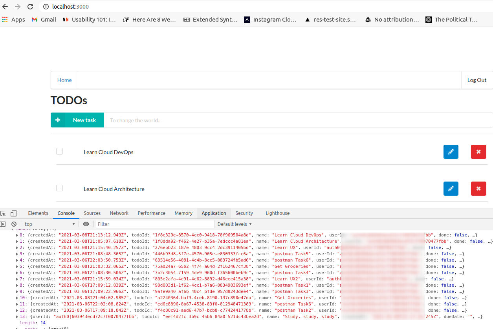

# Serverless Todo

# Purpose

This project's purpose is to create an application that creates, updates and deletes todo items and uploads an application image utilizing the Serverless framework, AWS API Gateway, Lambda, Dynamod Db and S3. This is part of Udacity's Cloud Developer - Section 6 Best Practices Project.

# ToDo items

The application will create a ToDo with the following information:

- `todoId` (string) - a unique identifier for the todo
- `userId` (string) - id of the user that created the todo
- `createdAt` (string) - date/time of creation of the todo
- `name` (string) - name of the Todo item
- `dueDate` (string) - date/time to complete the todo by
- `done` (boolean) - if the todo has been completed
- `attachmentUrl` (string) - URL pointing to the image attached to a TODO item

The information schemas can also be found in:

- [Json for request schema validation in backend/models](backend/models)
- [DynamoDb structure in serverless](backend/serverless.yml)
- [Typescript interfaces for Lambda Code](backend/src/models)

# Benefits

The benefits of developing the application using the Serverless framework are:

- Cloud portability - the serverless framework works with several cloud providers
- Lower cost using the pay-as-you go model of AWS API Gateway, Lambda and DynamoDb
- Authentication using Auth0 to reduce the code print and decrease time-to-market

# Overview

This application uses the [Serverless Framework](https://www.serverless.com/) for the creation and deployment of the AWS assets.

The creation of components using the serverless.yml files has been split into two parts for efficiency:
1 - /backend/infrastructure/serverless.yml
2 - /backend/serverless.yml

The infrastructurepart contains the DynamoDb tables and S3 Buckets. The backend/serverless.yml contains the Lamda functions and API gateway.

This split was made to reduce deployment time and increase deployment reliability. The infrastructure components (DynamoDb and S3), are relatively stable with less frequent updates from an infrastructure deployment perspective. The lambda functions in contrast change more frequently. Splitting the infrastructure from the code removes the DynamodDb and S3 components from Lambda code only changes.

_Note_: There are several logs written in the code. Normally these would be removed before going to production, but they were left in the code so anyone utilizing this code can see the events and data to better understand how the Serverless code works, especially concerining authentication.

## Installation

### Backend

Ensure that npm and node are already installed as a prerequisite. It's recommended to use NVM for easier management of node versions.

Then deploy the severless framework:

```
git clone repo <thisRepo>
cd <clonedDirectory>
cd backend
npm install
sls deploy -v
```

### Front-end

Edit and update client/src/config.ts with the endpoints from the _sls deploy_ command. If this information is no longer availble then cd into the backend directory and enter _sls info_.

_Example client/src/config.ts_

```
const apiId = '...'     // get from back-end sls deploy info
export const apiEndpoint = `https://${apiId}.execute-api.us-west-2.amazonaws.com/dev`

export const authConfig = {
  // TODO: Create an Auth0 application and copy values from it into this map
  domain: 'xyz.us.auth0.com',            // Auth0 domain
  clientId: 'ghi',                     // Auth0 client id
  callbackUrl: 'http://localhost:3000/callback'
}

```

Then start the application:

```
cd <clonedDirectory>
cd client
npm install
npm run start
```

# Technology Utilized

- [Serverless Framework for infrastructure creation and code deployment](https://www.serverless.com/)
- [AWS Lambda for code execution](https://aws.amazon.com/lambda/)
- [AWS API Gateway](https://aws.amazon.com/api-gateway/)
- [AWS S3 for image storage](https://docs.aws.amazon.com/s3/index.html)
- [DynamoDb for Cloud Db](https://aws.amazon.com/dynamodb/)
- [Auth0 for Authorization](https://auth0.com/)
- [JWT Tokens for user validation](https://jwt.io/)
- [Winston for Logging](https://github.com/winstonjs/winston)
- [Node.Js for JS runtime](https://nodejs.org/en/)
- [TypeScript](https://www.typescriptlang.org/)

# Authorization / JWT

Authorization is one of the trickier parts of developing this serverless application. For obtaining the public certificate used for validating the signature key there are two options:

1. Copying the certificate to a .pem file
2. Getting the certificate online from Auth0 jwksUrl. For example, from: 'https://dev-XYZ123.us.auth0.com/.well-known/jwks.json'

For this project, using a .pem file was chosen for simplicity reasons. Using a .pem file requires one less dependency across the network.

## 1) Using a .pem file for the certificate

backend/serverless.yml

```
  environment:
    AUTH0_PUBLIC_KEY: ${file(secret.pem)}

```

Go to Auth0 / application / Advanced Settings.

Copy the certificate to the secret.pem file.

## 2) Getting the certificate online from Auth0 jwksUrl

```
function getSigningKey(jwksUri: string, kid: string): string {
  let signingKey: string;

  const client = jwksClient({
    jwksUri: jwksUri,
    requestHeaders: {}, // Optional
    requestAgentOptions: {}, // Optional
    timeout: 30000, // Defaults to 30s
    cache: true,
    cacheMaxEntries: 5, // Default value
    cacheMaxAge: ms('10h'), // Default value
    rateLimit: true,
    jwksRequestsPerMinute: 10, // Default value
  });


  client.getSigningKey(kid, (err, key) => {
    if (!err) {
      signingKey = key.publicKey;
    } else
    {
      logger.info("getSigningKey ", { err })
    }
  });

  logger.info("getSigningKey ", { signingKey })

  return signingKey
}

```

### Sources

[Serverless example Auth0](https://github.com/serverless/examples/tree/master/aws-node-auth0-custom-authorizers-api)

[auth jwks-rsa](https://github.com/auth0/node-jwks-rsa)

[npmjs jwks-rsa](https://www.npmjs.com/package/jwks-rsa)

[StackOverflow](https://stackoverflow.com/questions/64275263/how-to-get-public-key-from-getsigningkey-function-of-jwks-rsa)

# Screenshots

## Authorization

Authorization Login


## AWS Components


## Create ToDos




## Delete ToDos


## Get ToDos


## Update ToDos


## Upload Image


# Issues Encountered

```
ERROR in /media/robert/Data/Development/udacity-CloudDeveloper/udac_CloudDev_6BestPractices_Severless_Todo/backend/src/dataLayer/todosAccess.ts
[tsl] ERROR in /media/robert/Data/Development/udacity-CloudDeveloper/udac_CloudDev_6BestPractices_Severless_Todo/backend/src/dataLayer/todosAccess.ts(64,30)
      TS2339: Property 'DocumentClient' does not exist on type 'PatchedAWSClientConstructor<ClientConfiguration, typeof DynamoDB>'.
```

Solution was found on:
https://knowledge.udacity.com/questions/98230

Change

```
private readonly docClient: DocumentClient = new AWS.DynamoDB.DocumentClient(),
```
